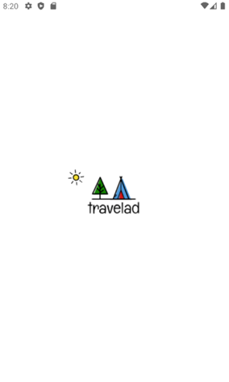
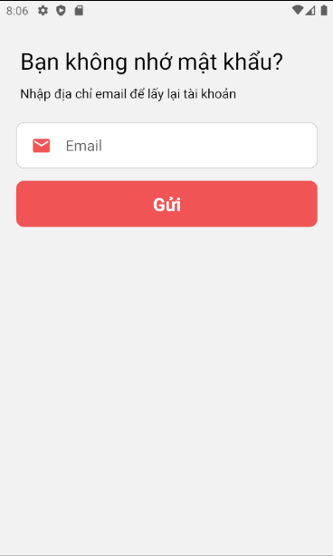
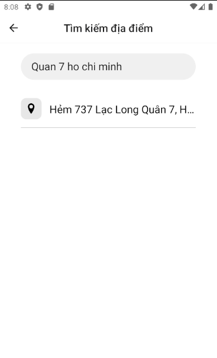
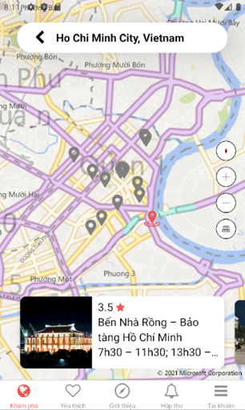
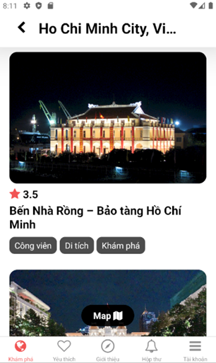
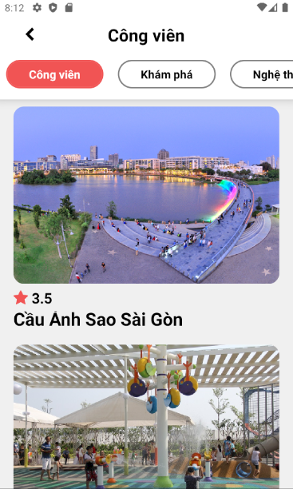
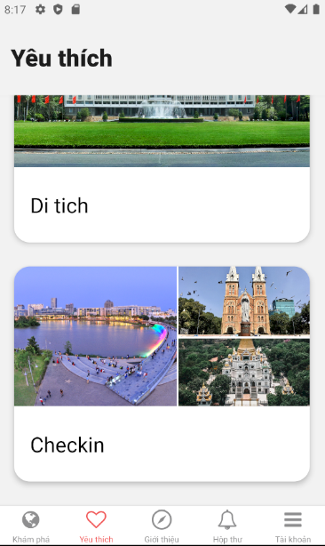
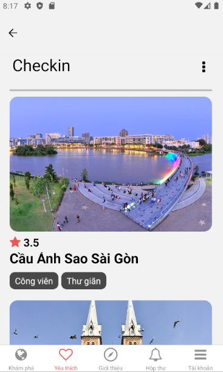
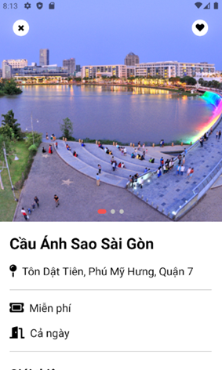
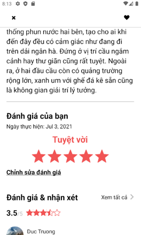

# Travelad

<p align="center">
    
</p>

## Yêu cầu thiết bị

Android

`Gradle : 6.7`

`minSdkVersion: 23`

`targetSdkVersion: 30`

  
## Công nghệ sử dụng

**ReactNative - Firebase**

  
## Màn hình
### Đăng ký, Đăng nhập, Quên mật khẩu

<p align="center">
    
    
   
</p>

### Khám phá

<p align="center">
    
    
</p>

### Tìm kiếm, danh sách địa điểm

<p align="center">
    
    
   
   
</p>

### Danh sách yêu thích

<p align="center">
    
   
</p>

### Chi tiết địa điểm

<p align="center">
   
   
</p>

### Đánh giá địa điểm

<p align="center">
   
</p>

### Giới thiệu

<p align="center">
    
</p>

### Thiết lập

<p align="center">
    
</p>

### Profile, Đổi mật khẩu

<p align="center">
    
   
</p>


 

  
## Cài đặt chương trình
#### Cài đặt packages

```bash 
  yarn
```
hoặc
```bash 
  npm install
```

#### Khởi động Metro

```bash 
  yarn start
```
hoặc
```bash 
  npx react-native start
```

#### Khởi động ứng dụng

```bash 
  yarn android
```
hoặc
```bash 
  npx react-native run-android
```
    
## Các tác giả

- [@Trương Hữu Minh Đức - 18520626](https://github.com/minhduc-1999)
- [@Phan Quốc An - 18520438](https://github.com/quocan22)

  
